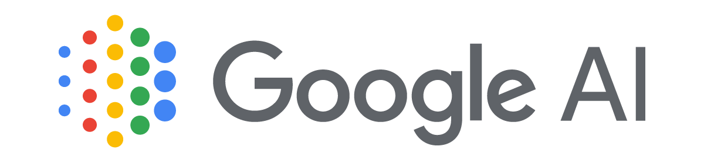
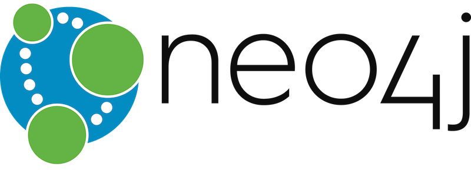

<h2 align="center"> Paion Data Dev Team Coffee-Morning News Central</h2>

<h3></h3>

<!-- GOOGLE-AI-BLOG:START -->
- [Generative AI to quantify uncertainty in weather forecasting](http://blog.research.google/2024/03/generative-ai-to-quantify-uncertainty.html)
- [AutoBNN: Probabilistic time series forecasting with compositional bayesian neural networks](http://blog.research.google/2024/03/autobnn-probabilistic-time-series.html)
- [Computer-aided diagnosis for lung cancer screening](http://blog.research.google/2024/03/computer-aided-diagnosis-for-lung.html)
- [Using AI to expand global access to reliable flood forecasts](http://blog.research.google/2024/03/using-ai-to-expand-global-access-to.html)
- [ScreenAI: A visual language model for UI and visually-situated language understanding](http://blog.research.google/2024/03/screenai-visual-language-model-for-ui.html)
<!-- GOOGLE-AI-BLOG:END -->

<h3></h3>

<!-- GOOGLE-DEEPMIND-BLOG:START -->
- [AlphaEvolve: A Gemini-powered coding agent for designing advanced algorithms](https://deepmind.google/discover/blog/alphaevolve-a-gemini-powered-coding-agent-for-designing-advanced-algorithms/)
- [Gemini 2.5 Pro Preview: even better coding performance](https://deepmind.google/discover/blog/gemini-25-pro-preview-even-better-coding-performance/)
- [Build rich, interactive web apps with an updated Gemini 2.5 Pro](https://deepmind.google/discover/blog/build-rich-interactive-web-apps-with-an-updated-gemini-25-pro/)
- [Music AI Sandbox, now with new features and broader access](https://deepmind.google/discover/blog/music-ai-sandbox-now-with-new-features-and-broader-access/)
- [Introducing Gemini 2.5 Flash](https://deepmind.google/discover/blog/introducing-gemini-2-5-flash/)
<!-- GOOGLE-DEEPMIND-BLOG:END -->

### [ML @ Reddit](https://www.reddit.com/r/MachineLearning/)

<!-- REDDIT-ML:START -->
- [[D] What review scores are typically required for a paper to be accepted at ICCV 2025?](https://www.reddit.com/r/MachineLearning/comments/1kq5cl4/d_what_review_scores_are_typically_required_for_a/)
- [[D] Scipy Sqp Solver for Optimization](https://www.reddit.com/r/MachineLearning/comments/1kq5api/d_scipy_sqp_solver_for_optimization/)
- [[D] Using MONAI outside of medicine](https://www.reddit.com/r/MachineLearning/comments/1kq2o5b/d_using_monai_outside_of_medicine/)
- [[D] The Dead Internet Theory: To what extent do its key themes hold up?](https://www.reddit.com/r/MachineLearning/comments/1kq07j3/d_the_dead_internet_theory_to_what_extent_do_its/)
- [[P] UQLM: Uncertainty Quantification for Language Models](https://www.reddit.com/r/MachineLearning/comments/1kpy5l3/p_uqlm_uncertainty_quantification_for_language/)
<!-- REDDIT-ML:END -->

<h3></h3>

<!-- ARANGO-BLOGS:START -->
- [Deploying and Securing an ArangoDB Cluster Using Docker](https://arangodb.com/2025/05/deploying-and-securing-an-arangodb-cluster-using-docker/)
- [Legal and Compliance challenges in modern finance and how ArangoDB plus GraphRAG solves them](https://arangodb.com/2025/05/legal-and-compliance-challenges-in-modern-finance-and-how-arangodb-plus-graphrag-solves-them/)
- [Deploying ArangoDB on Kubernetes and customizing settings](https://arangodb.com/2025/05/deploying-arangodb-on-kubernetes-and-customizing-settings/)
- [From Sensor Noise to Strategic Insights: How ArangoDB and GraphRAG are Reinventing IoT for Smart Manufacturing](https://arangodb.com/2025/05/from-sensor-noise-to-strategic-insights-how-arangodb-and-graphrag-are-reinventing-iot-for-smart-manufacturing/)
- [Integrating ArangoDB with Kubernetes for Seamless Deployment](https://arangodb.com/2025/04/integrating-arangodb-with-kubernetes-for-seamless-deployment/)
<!-- ARANGO-BLOGS:END -->

<h3></h3>

<!-- NEO4J-YOUTUBE:START -->
- [Using Aura Graph Analytics to Model NYC Subway Disruptions](https://www.youtube.com/watch?v=1qJkTqbpf5k)
- [FikaAI Interview with A N M Bazlur Rahman](https://www.youtube.com/watch?v=RCNM-LLVMCM)
- [FikaAI Interview with Abel Fresnillo](https://www.youtube.com/watch?v=e9od8ihGiE8)
- [FikaAI Interview with Ammar Yusuf](https://www.youtube.com/watch?v=8BEPBY6Oz4Q)
- [How to Detect Fraud in Peer-to-Peer Networks Using Aura Graph Analytics](https://www.youtube.com/watch?v=GCCRI3MJi_A)
<!-- NEO4J-YOUTUBE:END -->

<h3></h3>

<!-- ELASTIC-BLOGS:START -->
- [How to benchmark Elasticsearch performance with ingest pipelines and your own logs](https://www.elastic.co/blog/benchmark-elasticsearch-performance)
- [How to benchmark Elasticsearch performance with ingest pipelines and your own logs](https://www.elastic.co/blog/benchmark-elasticsearch-performance)
- [CMMC success by design: How Elastic and MAD Security deliver compliance confidence](https://www.elastic.co/blog/cmmc-success-by-design)
- [Agentic AI in financial services: The rise of autonomous intelligence](https://www.elastic.co/blog/agentic-ai-financial-services)
- [CMMC success by design: How Elastic and MAD Security deliver compliance confidence](https://www.elastic.co/blog/cmmc-success-by-design)
<!-- ELASTIC-BLOGS:END -->

<h3></h3>

<!-- OPENSTACK-SUPERUSER:START -->
- [OpenDev and Rackspace: Building Stronger Open Infrastructure Together](https://superuser.openinfra.org/articles/opendev-and-rackspace-building-stronger-open-infrastructure-together/)
- [Kolla Ansible OpenStack Installation &lpar;Ubuntu 24.04&rpar;](https://superuser.openinfra.org/articles/kolla-ansible-openstack-installation-ubuntu-24-04/)
- [The Power of OpenStack: How Sicredi Transformed Its Infrastructure to Stay Competitive](https://superuser.openinfra.org/articles/the-power-of-openstack-how-sicredi-transformed-its-infrastructure-to-stay-competitive/)
- [Streamlining OpenStack Upgrades: A Case Study of Indiana University’s Efficient Upgrade Strategy](https://superuser.openinfra.org/articles/streamlining-openstack-upgrades-a-case-study-of-indiana-universitys-efficient-upgrade-strategy/)
- [How OpenStack Powers BT Group’s 5G Network Transformation](https://superuser.openinfra.org/articles/how-openstack-powers-bt-groups-5g-network-transformation/)
<!-- OPENSTACK-SUPERUSER:END -->

<h3><a href="https://www.docker.com/blog/">Docker Blogs</a></h3>

<!-- DOCKER-BLOG:START -->
- [Docker at Microsoft Build 2025: Where Secure Software Meets Intelligent Innovation](https://www.docker.com/blog/docker-at-microsoft-build-2025/)
- [Securing Model Context Protocol: Safer Agentic AI with Containers](https://www.docker.com/blog/whats-next-for-mcp-security/)
- [Introducing Docker MCP Catalog and Toolkit: The Simple and Secure Way to Power AI Agents with MCP](https://www.docker.com/blog/announcing-docker-mcp-catalog-and-toolkit-beta/)
- [Simplifying Enterprise Management with Docker Desktop on the Microsoft Store](https://www.docker.com/blog/docker-desktop-on-microsoft-store/)
- [Update on the Docker DX extension for VS Code](https://www.docker.com/blog/docker-dx-extension-for-vs-code-update/)
<!-- DOCKER-BLOG:END -->

<h3><a href="https://kubernetes.io/blog/">Kubernetes Blogs</a></h3>

<!-- KUBERNETES-BLOG:START -->
- [Kubernetes v1.33: In-Place Pod Resize Graduated to Beta](https://kubernetes.io/blog/2025/05/16/kubernetes-v1-33-in-place-pod-resize-beta/)
- [Announcing etcd v3.6.0](https://kubernetes.io/blog/2025/05/15/announcing-etcd-3.6/)
- [Kubernetes 1.33: Job&#39;s SuccessPolicy Goes GA](https://kubernetes.io/blog/2025/05/15/kubernetes-1-33-jobs-success-policy-goes-ga/)
- [Kubernetes v1.33: Updates to Container Lifecycle](https://kubernetes.io/blog/2025/05/14/kubernetes-v1-33-updates-to-container-lifecycle/)
- [Kubernetes v1.33: Job&#39;s Backoff Limit Per Index Goes GA](https://kubernetes.io/blog/2025/05/13/kubernetes-v1-33-jobs-backoff-limit-per-index-goes-ga/)
<!-- KUBERNETES-BLOG:END -->

### Martin Fowler's Blog (**Building Software Effectively**)

<!-- MARTIN-FOWLER-BLOG:START -->
- [Building Custom Tooling with LLMs](https://martinfowler.com/articles/exploring-gen-ai/16-building-custom-tooling-with-llms.html)
- [Coding Assistants Threaten the Software Supply Chain](https://martinfowler.com/articles/exploring-gen-ai/software-supply-chain-attack-surface.html)
- [Function calling using LLMs](https://martinfowler.com/articles/function-call-LLM.html)
- [Building TMT Mirror Visualization with LLM](https://martinfowler.com/articles/exploring-gen-ai/15-building-tmt-mirror-visualization.html)
- [Additional explanatory material for the Deepseek Overview](https://martinfowler.com/articles/deepseek-papers.html)
<!-- MARTIN-FOWLER-BLOG:END -->

### [CSS-Trikcs](https://css-tricks.com/)

<!-- CSS-TRIKCS:START -->
- [HTML Email Accessibility Report 2025](https://css-tricks.com/html-email-accessibility-report-2025/)
- [Scroll-Driven Animations Inside a CSS Carousel](https://css-tricks.com/scroll-driven-animations-inside-a-css-carousel/)
- [This Isn’t Supposed to Happen: Troubleshooting the Impossible](https://css-tricks.com/this-isnt-supposed-to-happen-troubleshooting-the-impossible/)
- [Using Pages CMS for Static Site Content Management](https://css-tricks.com/using-pages-cms-for-static-site-content-management/)
- [Orbital Mechanics &lpar;or How I Optimized a CSS Keyframes Animation&rpar;](https://css-tricks.com/orbital-mechanics-or-how-i-optimized-a-css-keyframes-animation/)
<!-- CSS-TRIKCS:END -->
