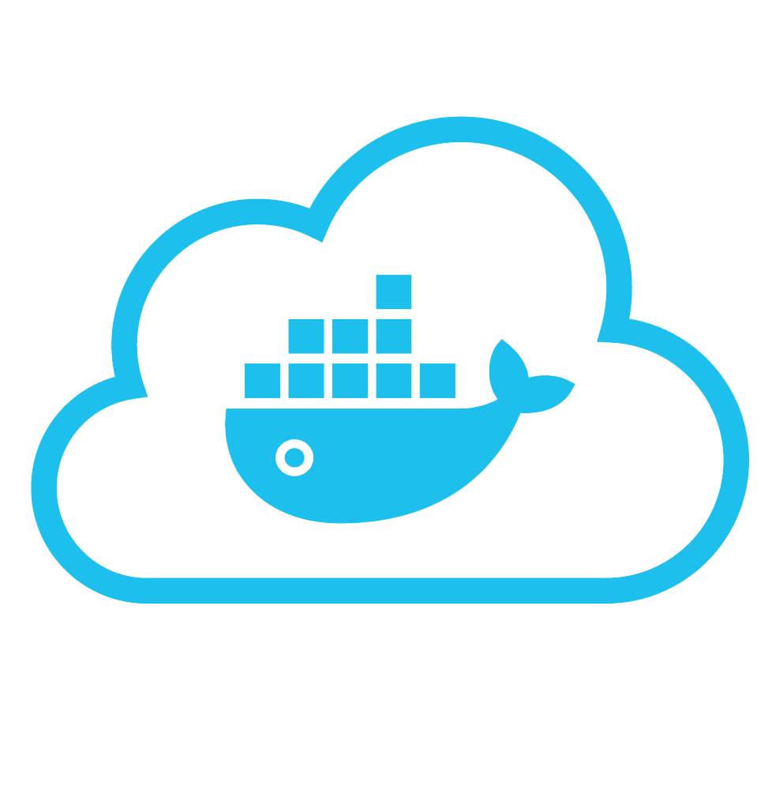

<h2 align="center"> Paion Data Dev Team Coffee-Morning News Central</h2>

<h3></h3>

<!-- GOOGLE-AI-BLOG:START -->
- [Generative AI to quantify uncertainty in weather forecasting](http://blog.research.google/2024/03/generative-ai-to-quantify-uncertainty.html)
- [AutoBNN: Probabilistic time series forecasting with compositional bayesian neural networks](http://blog.research.google/2024/03/autobnn-probabilistic-time-series.html)
- [Computer-aided diagnosis for lung cancer screening](http://blog.research.google/2024/03/computer-aided-diagnosis-for-lung.html)
- [Using AI to expand global access to reliable flood forecasts](http://blog.research.google/2024/03/using-ai-to-expand-global-access-to.html)
- [ScreenAI: A visual language model for UI and visually-situated language understanding](http://blog.research.google/2024/03/screenai-visual-language-model-for-ui.html)
<!-- GOOGLE-AI-BLOG:END -->

<h3></h3>

<!-- GOOGLE-DEEPMIND-BLOG:START -->
- [Advanced audio dialog and generation with Gemini 2.5](https://deepmind.google/discover/blog/advanced-audio-dialog-and-generation-with-gemini-25/)
- [Advancing Gemini&#39;s security safeguards](https://deepmind.google/discover/blog/advancing-geminis-security-safeguards/)
- [Fuel your creativity with new generative media models and tools](https://deepmind.google/discover/blog/fuel-your-creativity-with-new-generative-media-models-and-tools/)
- [Our vision for building a universal AI assistant](https://deepmind.google/discover/blog/our-vision-for-building-a-universal-ai-assistant/)
- [SynthID Detector — a new portal to help identify AI-generated content](https://deepmind.google/discover/blog/synthid-detector--a-new-portal-to-help-identify-ai-generated-content/)
<!-- GOOGLE-DEEPMIND-BLOG:END -->

### [ML @ Reddit](https://www.reddit.com/r/MachineLearning/)

<!-- REDDIT-ML:START -->
- [[R] GuidedQuant: Boost layer-wise PTQ methods using the end loss guidance &lpar;Qwen3, Gemma3, Llama3.3 / 2~4bit quantization&rpar; &lpar;ICML 2025&rpar;](https://www.reddit.com/r/MachineLearning/comments/1l2j8ts/r_guidedquant_boost_layerwise_ptq_methods_using/)
- [[D]: Tensorboard alternatives](https://www.reddit.com/r/MachineLearning/comments/1l2gqcn/d_tensorboard_alternatives/)
- [[D] what is the cheapest double descent experiment?](https://www.reddit.com/r/MachineLearning/comments/1l2ea55/d_what_is_the_cheapest_double_descent_experiment/)
- [Vision Language Models are Biased](https://www.reddit.com/r/MachineLearning/comments/1l2b9av/vision_language_models_are_biased/)
- [[D] What are your experiences with the European ELLIS program and would you recommend it?](https://www.reddit.com/r/MachineLearning/comments/1l27a0y/d_what_are_your_experiences_with_the_european/)
<!-- REDDIT-ML:END -->

<h3></h3>

<!-- ARANGO-BLOGS:START -->
- [Deploying and Securing an ArangoDB Cluster Using Docker](https://arangodb.com/2025/05/deploying-and-securing-an-arangodb-cluster-using-docker/)
- [Legal and Compliance challenges in modern finance and how ArangoDB plus GraphRAG solves them](https://arangodb.com/2025/05/legal-and-compliance-challenges-in-modern-finance-and-how-arangodb-plus-graphrag-solves-them/)
- [Deploying ArangoDB on Kubernetes and customizing settings](https://arangodb.com/2025/05/deploying-arangodb-on-kubernetes-and-customizing-settings/)
- [From Sensor Noise to Strategic Insights: How ArangoDB and GraphRAG are Reinventing IoT for Smart Manufacturing](https://arangodb.com/2025/05/from-sensor-noise-to-strategic-insights-how-arangodb-and-graphrag-are-reinventing-iot-for-smart-manufacturing/)
- [Integrating ArangoDB with Kubernetes for Seamless Deployment](https://arangodb.com/2025/04/integrating-arangodb-with-kubernetes-for-seamless-deployment/)
<!-- ARANGO-BLOGS:END -->

<h3></h3>

<!-- NEO4J-YOUTUBE:START -->
- [Neo4j Graph Analytics for Snowflake](https://www.youtube.com/watch?v=ZYAtiF-u72Y)
- [Predictive Maintenance with Neo4j Aura Graph Analytics for Factory Uptime](https://www.youtube.com/watch?v=uxRXiZ1gtw4)
- [Uncover Hidden Patterns with Neo4j Graph Analytics for Snowflake](https://www.youtube.com/watch?v=11lF_H121x8)
- [Finding Hidden Fraud Networks: Native Graph Analytics in Snowflake with Neo4j](https://www.youtube.com/watch?v=Bd3E4Q_TdF8)
- [Smarter GenAI with Neo4j AuraDB and Google Cloud](https://www.youtube.com/watch?v=nnnfKMk3hiM)
<!-- NEO4J-YOUTUBE:END -->

<h3></h3>

<!-- ELASTIC-BLOGS:START -->
- [Elastic Stack 8.18.2 released](https://www.elastic.co/blog/elastic-stack-8-18-2-released)
- [Elastic Stack 8.18.2 released](https://www.elastic.co/blog/elastic-stack-8-18-2-released)
- [Elastic and AWS collaborate to bring GenAI to DevOps, security, and search](https://www.elastic.co/blog/elastic-aws-bring-genai-to-devops-security-search)
- [How the MOD can achieve decision superiority against cyber threats](https://www.elastic.co/blog/decision-superiority-against-cyber-threats)
- [Elastic and AWS collaborate to bring GenAI to DevOps, security, and search](https://www.elastic.co/blog/elastic-aws-bring-genai-to-devops-security-search)
<!-- ELASTIC-BLOGS:END -->

<h3></h3>

<!-- OPENSTACK-SUPERUSER:START -->
- [OpenDev and Rackspace: Building Stronger Open Infrastructure Together](https://superuser.openinfra.org/articles/opendev-and-rackspace-building-stronger-open-infrastructure-together/)
- [Kolla Ansible OpenStack Installation &lpar;Ubuntu 24.04&rpar;](https://superuser.openinfra.org/articles/kolla-ansible-openstack-installation-ubuntu-24-04/)
- [The Power of OpenStack: How Sicredi Transformed Its Infrastructure to Stay Competitive](https://superuser.openinfra.org/articles/the-power-of-openstack-how-sicredi-transformed-its-infrastructure-to-stay-competitive/)
- [Streamlining OpenStack Upgrades: A Case Study of Indiana University’s Efficient Upgrade Strategy](https://superuser.openinfra.org/articles/streamlining-openstack-upgrades-a-case-study-of-indiana-universitys-efficient-upgrade-strategy/)
- [How OpenStack Powers BT Group’s 5G Network Transformation](https://superuser.openinfra.org/articles/how-openstack-powers-bt-groups-5g-network-transformation/)
<!-- OPENSTACK-SUPERUSER:END -->

<h3><a href="https://www.docker.com/blog/">Docker Blogs</a></h3>

<!-- DOCKER-BLOG:START -->
- [How to Make an AI Chatbot from Scratch using Docker Model Runner](https://www.docker.com/blog/how-to-make-ai-chatbot-from-scratch/)
- [Settings Management for Docker Desktop now generally available in the Admin Console](https://www.docker.com/blog/settings-management-for-docker-desktop-now-generally-available-in-the-admin-console/)
- [Introducing Docker Hardened Images: Secure, Minimal, and Ready for Production](https://www.docker.com/blog/introducing-docker-hardened-images/)
- [Docker at Microsoft Build 2025: Where Secure Software Meets Intelligent Innovation](https://www.docker.com/blog/docker-at-microsoft-build-2025/)
- [Securing Model Context Protocol: Safer Agentic AI with Containers](https://www.docker.com/blog/whats-next-for-mcp-security/)
<!-- DOCKER-BLOG:END -->

<h3><a href="https://kubernetes.io/blog/">Kubernetes Blogs</a></h3>

<!-- KUBERNETES-BLOG:START -->
- [Start Sidecar First: How To Avoid Snags](https://kubernetes.io/blog/2025/06/03/start-sidecar-first/)
- [Gateway API v1.3.0: Advancements in Request Mirroring, CORS, Gateway Merging, and Retry Budgets](https://kubernetes.io/blog/2025/06/02/gateway-api-v1-3/)
- [Kubernetes v1.33: In-Place Pod Resize Graduated to Beta](https://kubernetes.io/blog/2025/05/16/kubernetes-v1-33-in-place-pod-resize-beta/)
- [Announcing etcd v3.6.0](https://kubernetes.io/blog/2025/05/15/announcing-etcd-3.6/)
- [Kubernetes 1.33: Job&#39;s SuccessPolicy Goes GA](https://kubernetes.io/blog/2025/05/15/kubernetes-1-33-jobs-success-policy-goes-ga/)
<!-- KUBERNETES-BLOG:END -->

### Martin Fowler's Blog (**Building Software Effectively**)

<!-- MARTIN-FOWLER-BLOG:START -->
- [Should I still use analytics?](https://martinfowler.com/articles/202506-whither-analytics.html)
- [Bliki: Say Your Writing](https://martinfowler.com/bliki/SayYourWriting.html)
- [Interviewed by James Lewis at goto Copenhagen](https://www.youtube.com/watch?v=xsMUuOwv7IA)
- [Refresh of Agile Threat Modeling](https://martinfowler.com/articles/agile-threat-modelling.html)
- [Building Custom Tooling with LLMs](https://martinfowler.com/articles/exploring-gen-ai/16-building-custom-tooling-with-llms.html)
<!-- MARTIN-FOWLER-BLOG:END -->

### [CSS-Trikcs](https://css-tricks.com/)

<!-- CSS-TRIKCS:START -->
- [Getting Creative With HTML Dialog](https://css-tricks.com/getting-creative-with-html-dialog/)
- [Better CSS Shapes Using shape&lpar;&rpar; — Part 2: More on Arcs](https://css-tricks.com/better-css-shapes-using-shape-part-2-more-on-arcs/)
- [What We Know &lpar;So Far&rpar; About CSS Reading Order](https://css-tricks.com/what-we-know-so-far-about-css-reading-order/)
- [Better CSS Shapes Using shape&lpar;&rpar; — Part 1: Lines and Arcs](https://css-tricks.com/better-css-shapes-using-shape-part-1-lines-and-arcs/)
- [You can style alt text like any other text](https://css-tricks.com/you-can-style-alt-text-like-any-other-text/)
<!-- CSS-TRIKCS:END -->
